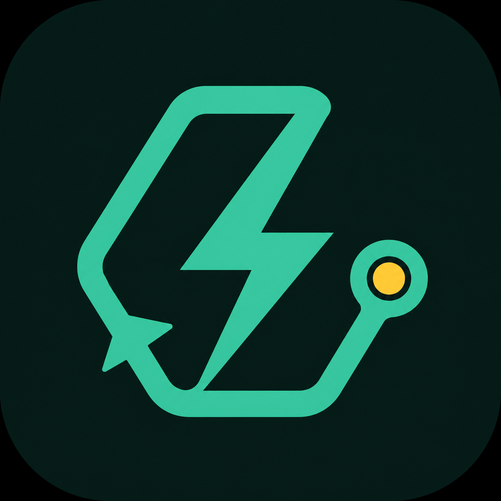
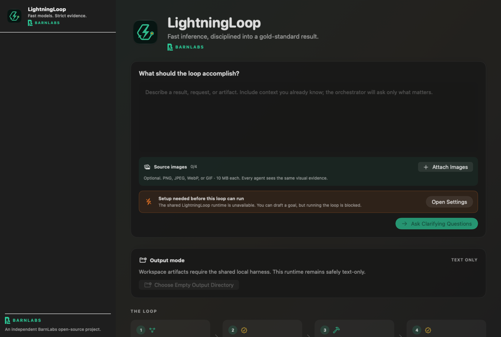
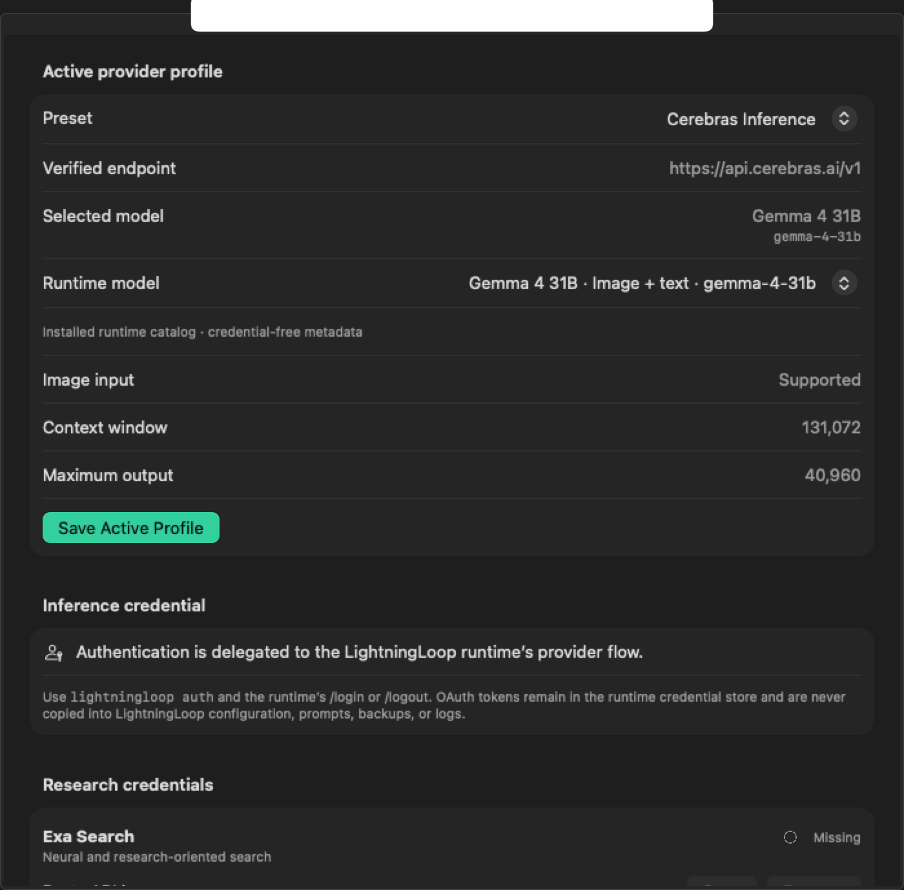
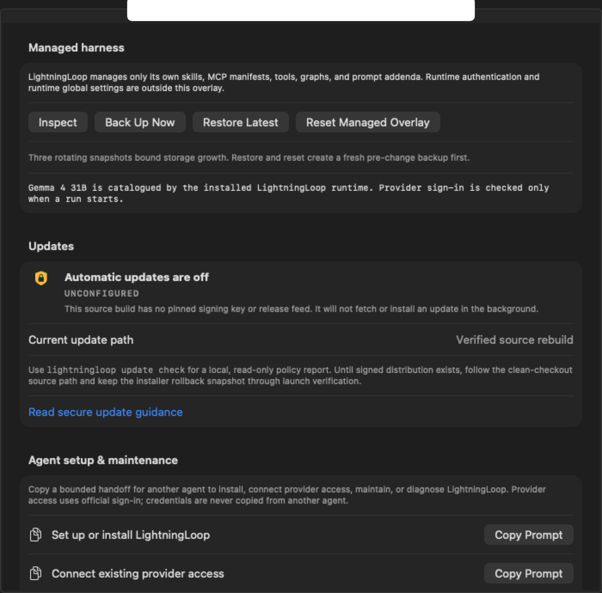
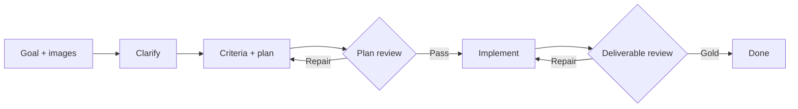

<p align="center">
  
</p>

# LightningLoop

**Fast models. Strict evidence.**

LightningLoop is BarnLabs’ open-source macOS app and cross-platform terminal interface for disciplined agent work. It turns a goal into a bounded loop: clarify, plan, challenge, implement, gather proof, and pause honestly when the available evidence cannot prove the outcome.



## Start here

- **Contributors (Mac, humans, AI agents):** begin at **[checklist.md](checklist.md) Phase 0**, then [CONTRIBUTING.md](CONTRIBUTING.md). Work one phase / one LL-ID at a time — do not one-shot production release rows.
- **macOS GUI + terminal:** follow the [source-install path](#macos-gui-and-tui).
- **Windows terminal:** follow the [Windows TUI path](#windows-tui).
- **First loop:** complete [first-run setup](#first-run), state the result you need, then answer the clarifying questions.
- **Agent handoff:** copy a safe [setup, access, update, or repair prompt](docs/AGENT_SETUP_AND_MAINTENANCE.md).
- **Production ID table:** [PRODUCTION_READINESS_CHECKLIST.md](PRODUCTION_READINESS_CHECKLIST.md) (status ledger; not a one-shot task list).

LightningLoop is the product. BarnLabs is the open-source project steward. Provider and runtime details support the product; they are not its public identity.

## Product surfaces

| Exact runtime model selection | Fail-closed update readiness |
|---|---|
|  |  |

The settings captures use deterministic, credential-free UI fixtures from the current Debug build. They demonstrate the interface contract—not provider entitlement, signed-release readiness, or live accessibility approval. The complete [UI evidence record](docs/UI_EVIDENCE_2026-07-21.md) also preserves current working and blocked-state captures with their build identity and limitations.

## Why it exists

Fast models are often judged from one-shot prompts. LightningLoop tests a different thesis: speed is most useful when it buys more independent critique and repair. A run reaches **Gold** only when the reviewer scores it at least 9/10 without rounding, finds no medium, high, or blocking issue, requests no further change, and cites harness evidence bound to each criterion's explicit proof predicate and an independently supported objective contract. Search snippets, reference images, file hashes, implementer prose, syntax, builds, and reviewer approval do not prove that an artifact solved the user's goal. Until owner-supplied typed objective contracts ship, artifact and general semantic work pauses for owner acceptance even when its deterministic checks pass. Exhausting the configured round cap pauses the run; it never becomes a false pass.



## What is included

- A native SwiftUI macOS client with local history, source-image attachments, visible criteria, plan, reviews, trace, and run metrics.
- A shared runtime integration for provider catalogs and official sign-in flows, while LightningLoop keeps its product, history, and evidence boundaries independent from providers.
- Bounded promise/duty graphs with named requirements, outputs, routes, evidence traces, per-node visit caps, and total-step caps.
- The shared runtime owns catalogs and model selection for every Pi-managed built-in provider. Custom and GeneralCompute profiles use LightningLoop's native `/models` discovery and connection test; that path cannot execute a loop without the shared harness.
- Optional iterative research through Exa, Brave, or Firecrawl in the shared harness. The orchestrator researches before planning, and harsh reviewers may request narrow follow-up queries between repair rounds. Queries, URLs, and result counts are deduplicated and capped per run. Search snippets remain unverified; the harness can open the leading HTTPS sources with redirects disabled, preserve retrieval time/content hash/source class, and bind factual criteria to an exact opened URL. The parity-tested native research implementation is not reachable from production loop execution while no-harness execution is blocked.
- A shared TypeScript state machine used by the CLI and, when discoverable, the native app through a versioned JSONL subprocess protocol.
- A policy-wrapped terminal interface that starts read-only. Optional execution uses a separate OS-sandboxed, per-call-confirmed path.
- A platform-native managed overlay for skills, MCP manifests, tools, graphs, and prompts, with secret/tamper checks, three rotating backups, and explicit managed-skill install/enable/disable commands that never cross into runtime-owned state. Imported skills start disabled. Enable verifies a unique non-active staging tree before one atomic rename; disable atomically quarantines the active copy even when the inactive installation contains secret-shaped or symlink drift.
- Permissioned macOS notifications plus cross-platform terminal/hook notifications for Gold, blockers, and required input.
- A fail-closed Ed25519 update-manifest foundation; automatic installation stays disabled until signed platform release channels exist.
- An opt-in **Evidence Lab** that creates run-owned files in a dedicated empty directory, proactively selects bounded single-process Python and JavaScript checks, runs only structured single-process verification in the network-denied macOS sandbox, captures duration and redacted output, serves HTML on an ephemeral `127.0.0.1` endpoint, renders CSP-confined PNG proof, and feeds only harness-observed evidence back to the reviewer. Multi-process compilers and test runners, including Cargo, fail closed in autonomous verification.
- An in-app evidence workspace with hash-verified static picture evidence, response metadata, expandable script-runner output, bounded source inspection, Finder reveal, and explicit links that open created files in their default apps. HTML opens only in the system default browser through a short-lived loopback handoff.
- A bounded photo-to-3D workflow that normalizes an attached image, generates textured GLB and OBJ relief models plus a shaded preview, reopens the GLB, and reports every artifact hash while explicitly disclosing the limits of single-view reconstruction.
- Local provenance-aware memory with session binding and explicit durable promotion. A reviewed evolution ledger can activate bounded system-prompt or advisory skill guidance; proposals never activate themselves, and tools/MCPs stay separately gated.

## Providers and images

Choose a preset in **Settings**. Pi-managed built-in presets use the shared runtime’s official sign-in or environment-variable resolution; LightningLoop never copies the resulting OAuth or API-key credential. **GeneralCompute** is LightningLoop-managed: fixed base URL, API key in Keychain or `GENERALCOMPUTE_API_KEY`, and Settings Discover Models & Test (not runtime `/login`). Historical LightningLoop-owned Keychain service identifiers are retained only so local memory, evolution, errors, and migration paths can reject credential values without enumerating runtime-owned state. A custom provider is a macOS-only, explicit user-trusted public HTTPS hostname and its connection can be tested in Settings, but loop clarification, execution, and Gold all require the shared harness.

Image inputs are deliberately bounded: PNG, JPEG, WebP, or GIF; up to four files; 10 MB each. LightningLoop validates the decoded image type, copies it into protected app storage, and sends it only to the active provider during the run. Text-only models reject image-bearing runs before inference.

Provider capabilities and model availability change. For Pi-managed built-in providers, the installed runtime catalog is the source of truth for which model IDs LightningLoop may start; it does not prove provider sign-in or account entitlement. Custom and GeneralCompute profiles use native `/models` discovery and a connection test.

## Research

Research is opt-in. The shared harness asks the model for up to three narrow searches, retrieves at most five results per query, preserves source URLs, and labels all excerpts as untrusted evidence. Up to two leading HTTPS results per query may be opened with redirects disabled and strict time/type/size limits; these retrieval-time/hash-preserved records can support review but cannot certify factual truth or automatic Gold. “Official-or-primary candidate” is a routing class, not a truth verdict. Apart from `.gov` and `.edu`, a host receives that routing label only when its exact lowercase hostname appears in the comma-separated `LIGHTNINGLOOP_SOURCE_HOST_ALLOWLIST`; general-web results can also inform a draft. In every case, the planner selected the claim, so factual completion pauses for owner acceptance even when the case-sensitive excerpt literally occurs in the exact opened record. Research credentials use official environment variables cross-platform or separate macOS Keychain entries. Root `llms.txt` retrieval is off by default and requires an exact-host allowlist.

## Install from GitHub

Requirements:

- macOS 14+ for the GUI; macOS or Windows for the TUI
- Xcode 16+ and [XcodeGen](https://github.com/yonaskolb/XcodeGen) for the GUI
- Node.js 22.19+ for the shared harness and TUI. For a Finder-launchable macOS GUI install, Node must be executable at exactly `~/.local/node/bin/node`, `/opt/homebrew/bin/node`, or `/usr/local/bin/node`.
- a compatible provider login or API key for at least one inference provider

### macOS GUI and TUI

Clone the canonical BarnLabs repository, bind the checkout's own `origin` fetch URL and clean `main` branch to that repository, then use the checked-in executable installer. An unrelated successful `gh repo view barnlabs/LightningLoop` query is not checkout authentication. The installer independently rejects an absent/forked origin, another branch, a dirty tree, or a HEAD that differs from the fetched canonical `origin/main` before any package or build step. It then verifies the complete harness, creates a universal Release build, ad-hoc signs that local build, and stages a locked, recoverable GUI/TUI transaction in `~/Applications` and `~/.local/bin`. This is not one filesystem-atomic set: an exclusive install lock prevents cooperating concurrent installers, each directory transition uses same-volume `renameatx_np(RENAME_EXCL)`, and a rollback snapshot restores the prior set on a failed commit. After the fresh root `npm ci --ignore-scripts` populates npm's content-addressed cache, the staging tool independently hashes each required production archive against its exact lockfile SRI before bounded create-new extraction; it never trusts the mutable root `node_modules` tree. Before manifest authority is written, the same archive-derived pass compares every staged path/mode/size/hash and binds real, stable dependency-container identities; symlink containers and generated `.bin` executables fail closed. The archive parser and runtime manifest bind all 46 packed paths/types/modes/sizes/hashes, archive/package/bin/engine metadata, and 136 dependency integrity/version/tree records, then verify the installed tree again before any CLI execution. The 2026-07-20 review packet records the completed local install and normal Finder-launch smoke. Shell-only Node managers such as nvm, fnm, asdf, and Volta are not sufficient for normal Finder launch unless their supported Node binary is linked or installed at `~/.local/node/bin/node`.

```bash
git clone https://github.com/barnlabs/LightningLoop.git
cd LightningLoop
test "$(git remote get-url origin)" = "https://github.com/barnlabs/LightningLoop.git"
git fetch --no-tags origin main
git merge --ff-only FETCH_HEAD
test "$(git rev-parse HEAD)" = "$(git rev-parse refs/remotes/origin/main)"
test -z "$(git status --porcelain=v1)"
./script/install_from_github.sh
```

The app discovers the exact TUI package installed under `~/.local/lib/node_modules`, so a normal Finder launch is designed not to depend on the checkout or a temporary environment variable. It also uses only the three documented Finder-launchable Node locations above. If an older GUI is present, the installer first requires the exact old app process to disappear, stages both replacements, then records the old GUI, TUI package, and aliases in a unique backup under `~/Library/Application Support/LightningLoop/InstallerBackups/` before committing. Launch proof requires one newly observed stable PID executing the installed app, not merely any old process with the same name. Isolated fixtures prove that mid-backup, mid-commit, installed-signature, and launch-smoke failures restore the complete prior GUI/TUI/alias byte state and that an incomplete rollback returns nonzero; the completed post-PASS source install supplied the live proof at `~/Applications/LightningLoop.app` and `~/.local/bin`. Add `~/.local/bin` to `PATH` if your shell does not already include it.

Run `llp` or `lloop` with no arguments to open the interactive TUI. The full `lightningloop` command remains available for scripts and explicit subcommands.

The three command names invoke the same packed entry point: use **`llp`** for the shortest interactive launch, **`lloop`** as the readable short form, and **`lightningloop`** for automation and explicit subcommands. `help`, `--help`, and `-h` only print usage; they never start the TUI.

To update later, keep the worktree clean and fast-forward from GitHub before rerunning the same verified installer:

```bash
cd LightningLoop
git status --short --branch
test "$(git branch --show-current)" = "main"
case "$(git remote get-url origin)" in
  https://github.com/barnlabs/LightningLoop|https://github.com/barnlabs/LightningLoop.git|git@github.com:barnlabs/LightningLoop.git|ssh://git@github.com/barnlabs/LightningLoop.git) ;;
  *) echo "origin is not barnlabs/LightningLoop" >&2; exit 1 ;;
esac
test -z "$(git status --porcelain=v1)"
git fetch --no-tags origin main
git merge --ff-only FETCH_HEAD
test "$(git rev-parse HEAD)" = "$(git rev-parse refs/remotes/origin/main)"
test -z "$(git status --porcelain=v1)"
./script/install_from_github.sh
```

LightningLoop does not publish a signed/notarized binary release yet. Do not bypass Gatekeeper or run a downloaded `LightningLoopUITests-Runner`; that is an internal test host, not the app. Build from the canonical source checkout until the documented signing and notarization gates are complete.

### Windows TUI

Use PowerShell with Node.js 22.19+ and Git for Windows installed. The checked-in installer verifies the portable contracts, packs and directly extracts the allowlisted CLI, creates three deterministic no-replace shims, and independently SRI-verifies every required production archive from npm's content-addressed cache before bounded create-new extraction. The same complete packed-root/package/dependency manifest is checked after commit. A resolved-prefix exclusive file lease is held through rollback and cleanup; staging and backup stay on that live volume; reparse/junction/cross-volume prefixes and recreated package/shim targets fail closed through same-volume .NET no-replace renames. The committed `windows-2025` workflow remains the authoritative Windows smoke gate; documentation or macOS review alone is not a Windows release claim.

```powershell
git clone https://github.com/barnlabs/LightningLoop.git
Set-Location LightningLoop
if ((git remote get-url origin) -cne "https://github.com/barnlabs/LightningLoop.git") { throw "origin is not barnlabs/LightningLoop" }
git fetch --no-tags origin main
git merge --ff-only FETCH_HEAD
if ((git rev-parse HEAD) -cne (git rev-parse refs/remotes/origin/main)) { throw "HEAD is not fetched canonical main" }
if (git status --porcelain=v1) { throw "checkout is dirty" }
.\script\install_tui.ps1
lightningloop provider list
lightningloop provider select cerebras
llp
lightningloop doctor
```

Update with a clean fast-forward and rerun the installer:

```powershell
Set-Location LightningLoop
if ((git branch --show-current) -cne "main") { throw "checkout is not on main" }
$allowedOrigins = @(
    "https://github.com/barnlabs/LightningLoop",
    "https://github.com/barnlabs/LightningLoop.git",
    "git@github.com:barnlabs/LightningLoop.git",
    "ssh://git@github.com/barnlabs/LightningLoop.git"
)
if ((git remote get-url origin) -cnotin $allowedOrigins) { throw "origin is not barnlabs/LightningLoop" }
if (git status --porcelain=v1) { throw "checkout is dirty" }
git fetch --no-tags origin main
git merge --ff-only FETCH_HEAD
if ((git rev-parse HEAD) -cne (git rev-parse refs/remotes/origin/main)) { throw "HEAD is not fetched canonical main" }
if (git status --porcelain=v1) { throw "checkout is dirty" }
.\script\install_tui.ps1
```

The package remains private to the repository until a signed release channel exists, so the supported GitHub path is clone → verify → local pack → install—not an unverified registry or release-asset shortcut.

## First run

The terminal interface has no silent default provider. On clean data, `llp` exits before invoking the shared runtime and prints the two selection commands. Run `lightningloop provider list`, then `lightningloop provider select PRESET`; the bounded `provider.json` contains model/provider metadata only, never a credential. `doctor --runtime-only` is reserved for installer runtime health, while normal `doctor` continues to report incomplete provider onboarding.

Then open **LightningLoop → Settings**:

1. Choose Codex, Claude, Grok, Cerebras, Groq, Fireworks, GeneralCompute, or Custom.
2. Select a built-in model from the installed runtime catalog, or enter/discover a model for Custom or GeneralCompute. Cerebras starts with the guarded public-preview `Gemma 4 31B` preference and cannot run it unless the exact `gemma-4-31b` ID appears in the installed catalog. GeneralCompute starts with `minimax-m2.7`.
3. Use the shared runtime’s official sign-in or environment-variable resolution for every Pi-managed built-in provider. For GeneralCompute, save the API key in Settings or set `GENERALCOMPUTE_API_KEY`.
4. Run **Discover Models & Test** for Custom or GeneralCompute; the shared runtime validates Pi-managed provider authentication when the graph starts.
5. Optionally enable research and save a search-provider key.
6. Start a loop, attach source images if needed, and answer the clarifying questions.
7. For real files, choose an empty output directory before starting the loop. The Evidence Lab—generated-code execution, bounded automatic checks, loopback HTML proof, and static picture capture—has a separate warning and approval.

## Terminal and TUI

```bash
./script/run_tui.sh doctor
./script/run_tui.sh auth
./script/run_tui.sh loop "Write a launch brief" --cycles 4
./script/run_tui.sh loop "Audit this interface" --image ./screen.png --research brave
./script/run_tui.sh loop "Build a tested static site" --workspace /absolute/empty/output \
  --approve-artifact-writes --approve-verification-commands
./script/run_tui.sh tui
./script/run_tui.sh harness backup
./script/run_tui.sh update check
```

Inside the TUI, `/loop GOAL` runs the complete clarify → research → plan/review → gap-research → implement/verify/review state machine. `/research exa|brave|firecrawl|off` selects bounded iterative research, `/image PATH` queues a validated image, `/artifacts /absolute/empty/output --verify` grants the Evidence Lab for subsequent loops, `/artifacts off` revokes it, and `/loop-cancel` stops an active run. Final TUI output includes static-preview paths, localhost status, hashes, automatic-versus-implementer runner provenance, duration, and pass/fail state. `/memory` lists the protected ledger; `/memory-add`, `/memory-promote`, and `/memory-delete` provide explicit durable-memory control. `/evolution` lists versioned changes; `/evolution-propose`, `/evolution-evidence`, `/evolution-advance`, and `/evolution-rollback` expose the same ordered lifecycle as the GUI. Every advance is one confirmed transition. Activating a tool or MCP record changes ledger state only—it never grants execution authority or bypasses the separately pinned manifest, sandbox, and per-invocation approval. `/quit` and `/exit` both close the interface. The TUI advertises provider, model, research, and artifact state, fits standard 80-column terminals, and keeps credentials outside the model/tool environment.

Runtime arguments after `--` are restricted to safe presentation/session options. Tool, extension, provider, model, and session-directory overrides are rejected so passthrough flags cannot weaken LightningLoop’s boundary.

## Safety and privacy

- The shared runtime owns built-in inference authentication and refresh. LightningLoop does not copy runtime credentials into source, settings JSON, sessions, exports, logs, or managed backups. Research keys use official environment variables cross-platform or device-only Keychain entries on macOS.
- Goals, attached images, answers, plans, reviews, drafts, and bounded research evidence may be sent to the provider(s) the user selects.
- Local state lives under `~/Library/Application Support/LightningLoop/` with restrictive permissions.
- Prompt content, managed memories, skill guidance, and web excerpts are treated as untrusted data. Model-level prompt injection remains a residual risk.
- Run memory is bound to one native session. Project/user memory enters future runs only after explicit promotion and is capped before prompt insertion.
- Evolution activation requires source review, a named evaluation, adversarial review, explicit user approval, and a rollback target. Active skills are advisory and cannot grant capabilities.
- Custom API hosts must be public DNS names over HTTPS. Literal IPs, localhost, `.local` names, URL credentials, queries, and fragments are rejected.
- The loop is autonomous only inside explicit round, token, attachment, search, timeout, workspace, and tool limits.
- Root `llms.txt` research is off by default and exact-host allowlisted; retrieved content remains bounded and untrusted.
- Artifact mode never overwrites an existing directory. Revisions may replace only files owned by that run; traversal, links, credential-like paths/content, command-shell syntax, and failed workspace audits stop Gold.
- HTML picture evidence is captured only after Evidence Lab approval. The native app never embeds generated HTML. A user-clicked link revalidates the reviewed SHA-256 and opens a tokenized, short-lived `127.0.0.1` URL in the system default browser with restrictive HTTP security headers. Other created formats, including Blender and STL files, open through their registered default applications.

See [SECURITY.md](SECURITY.md), [the threat model](docs/THREAT_MODEL.md), and [the security review](docs/SECURITY_REVIEW.md) before expanding permissions.

Checked-in proof artifacts include the [generated photo relief](Examples/PhotoRelief/README.md) and the [responsive BarnLabs landing example](Examples/GoldLanding/README.md), including real 375 px and 1280 px browser captures.

## Verify

```bash
xcodegen generate
xcodebuild \
  -project LightningLoop.xcodeproj \
  -scheme LightningLoop \
  -derivedDataPath .build/DerivedData \
  CODE_SIGNING_ALLOWED=NO \
  test

# Compile the isolated keyboard/accessibility journey without requesting UI control.
xcodebuild \
  -project LightningLoop.xcodeproj \
  -scheme LightningLoopUI \
  -derivedDataPath .build/UIBuild \
  CODE_SIGNING_ALLOWED=NO \
  build-for-testing

npm run verify:harness
```

The native unit suite covers fail-closed no-harness clarification/execution, provider validation and explicit custom connection testing, image import bounds, managed-memory scoping, terminal/native ledger compatibility, and reviewed prompt/skill activation. The isolated UI suite compiles a stable accessibility surface, a no-credential launch, Command-N behavior, and screenshot capture. Running that UI test locally requires granting Xcode's test runner macOS Accessibility/automation permission; compilation remains non-interactive and runs in CI. The harness suite covers the shared loop, owner-acceptance boundary, research injection, multimodal validation, JSONL recovery and cancellation, traversal and symlink rejection, OS-sandbox allow/deny behavior, fail-closed MCP execution, protected memory/evolution mutations and runtime gates, secret redaction, and prompt-channel separation.

## Architecture

```text
LightningLoop/  SwiftUI app, runtime bridge, fail-closed native boundary, persistence, views
Harness/        runtime adapter, promise graphs, CLI/TUI, search, sandbox, MCP, governance, updates
Examples/       checked-in artifact workflow examples
Tools/          reviewed built-in artifact generators
docs/           architecture, capabilities, threat model, review, brand research
skills/         one minimal project-local harness-maintenance skill
```

More detail: [Architecture](docs/ARCHITECTURE.md) · [Capabilities](docs/CAPABILITIES.md) · [Runbook](RUNBOOK.md)

## Current boundaries

- `ponytail:` Source builds use the shared Node harness when it is discoverable; a signed/notarized release with a bundled runtime is not published yet.
- `ponytail:` Native and terminal histories are separate and cannot resume one another’s runs.
- `ponytail:` Reviewed artifact mode creates new projects in a dedicated empty directory. Editing an existing repository and automatically activating MCP/tool evolutions remain separate, explicitly approved operations.
- `ponytail:` The isolated native keyboard/accessibility/screenshot journey compiles, but its live run is pending macOS Accessibility/automation approval. The OS canceled the runner while system authentication was active, and Computer Use also timed out attaching. No security control was weakened and no stale provider-branded screenshot is presented as proof.
- Provider presets and default model IDs can age; model discovery and the provider’s current documentation remain authoritative.

## Brand, runtime, and third parties

LightningLoop uses BarnLabs’ forest, mint, paper, and signal-gold palette with a product-specific loop/bolt icon. The parent BarnLabs mark remains separate and unmodified.

LightningLoop is an independent BarnLabs open-source project. Its pinned Pi runtime dependency is named here for technical attribution, not product branding. Provider names and trademarks belong to their respective owners; compatibility does not imply affiliation, endorsement, sponsorship, or partnership. See [NOTICE.md](NOTICE.md) and [the brand guide](docs/BRAND.md).

## Contributing

Focused issues and pull requests are welcome. Read [CONTRIBUTING.md](CONTRIBUTING.md), [SECURITY.md](SECURITY.md), and [RUNBOOK.md](RUNBOOK.md).

MIT © 2026 BarnLabs.
