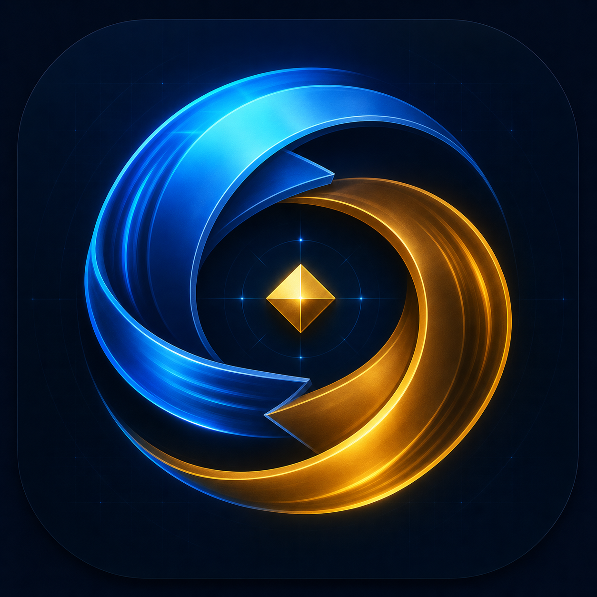
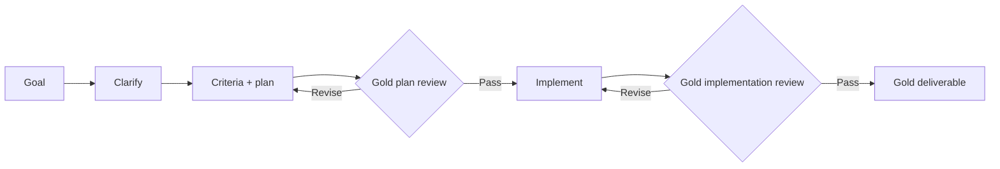

<p align="center">
  
</p>

# CerebrasLoop

**Fast models. Ruthless review.**

CerebrasLoop is a native macOS demonstration of how a relatively small, extremely fast model can produce stronger work when it is placed inside a strict clarify → plan → review → implement → review loop. It runs **Gemma 4 31B** (`gemma-4-31b`) on the Cerebras Inference API.


## The loop

1. **Orchestrator clarifies** the request with a few decision-critical questions.
2. **Orchestrator creates** atomic acceptance criteria and a falsifiable execution plan.
3. **Gold Reviewer challenges** the plan. Rejected plans return to the orchestrator for repair.
4. **Implementer produces** the complete text/Markdown deliverable.
5. **Gold Reviewer audits** every criterion. Rejected work returns to the implementer.
6. The run ends at **Gold** only when the reviewer returns a score of at least 9/10, no high/blocking finding, and no required change.

Review rounds are capped from 1–8 per stage. If the cap is reached, CerebrasLoop pauses with the remaining findings visible; it never converts exhaustion into a false success.



## Live proof

The repository’s captured demo run on July 19, 2026 completed a full clarification, plan review, implementation, and implementation review with:

- plan review: **10/10**
- implementation review: **10/10**
- total tokens: **4,877**
- measured completion speed: **1,118 tokens/second**
- summed model time: **1.21 seconds**
- estimated model cost: **$0.0054**

Those numbers are one observed run, not a performance or cost guarantee. Queueing, prompt length, model behavior, availability, and provider pricing can change.

## Safety and privacy

- The Cerebras API key is stored in **macOS Keychain**, never in source, UserDefaults, loop history, exports, or logs.
- Goals, answers, plans, reviews, and drafts are sent to Cerebras when a loop runs.
- Loop history is stored locally in `~/Library/Application Support/CerebrasLoop/sessions.json`.
- The implementer produces text/Markdown only. The app does **not** execute model-generated commands or silently edit files.
- Prompt content is treated as untrusted data, and the reviewer independently applies the explicit rubric. Model-level prompt injection remains a residual risk.
- Token count, model time, estimated cost, agent handoffs, review scores, and findings remain visible in the UI.

Read [SECURITY.md](SECURITY.md) before expanding the app’s permissions or execution capabilities.

## Requirements

- macOS 14 or newer
- Xcode 16 or newer
- a Cerebras Inference API key with access to `gemma-4-31b`

The app uses the OpenAI-compatible `POST /v1/chat/completions` endpoint and sends `X-Cerebras-Version-Patch: 2`. The model ID and structured-output capabilities were verified against the account used for this demo on July 19, 2026. See Cerebras’s [supported-model documentation](https://inference-docs.cerebras.ai/models/overview) and [API versioning guide](https://inference-docs.cerebras.ai/api-reference/versions).

## Build and run

```bash
git clone https://github.com/baney75/CerebrasLoop.git
cd CerebrasLoop
./script/build_and_run.sh --verify
```

Or open `CerebrasLoop.xcodeproj` and run the `CerebrasLoop` scheme.

On first launch:

1. Open **CerebrasLoop → Settings**.
2. Paste a Cerebras API key and choose **Save Key**.
3. Choose **Test Connection**.
4. Create a new loop and describe the outcome you want.

The project also includes a Codex Run action at `.codex/environments/environment.toml`.

## Test

```bash
xcodebuild \
  -project CerebrasLoop.xcodeproj \
  -scheme CerebrasLoop \
  -derivedDataPath .build/DerivedData \
  CODE_SIGNING_ALLOWED=NO \
  test
```

The deterministic suite covers reviewer rejection and repair, the 9/10 Gold threshold, exhaustion behavior, and fenced JSON recovery. Live API calls are intentionally excluded from the default test suite.

## Project layout

```text
CerebrasLoop/
├── App/        macOS scenes and lifecycle
├── Models/     loop state, criteria, reviews, and metrics
├── Services/   Cerebras client, prompts, Keychain, and loop engine
├── Stores/     local session state and persistence
├── Support/    branding and Markdown rendering
└── Views/      native sidebar, composer, settings, and workspace
```

The Xcode project is generated from `project.yml` with XcodeGen and committed so cloning contributors do not need XcodeGen for a normal build.

## Contributing

Focused issues and pull requests are welcome. Read [CONTRIBUTING.md](CONTRIBUTING.md), [SECURITY.md](SECURITY.md), and [RUNBOOK.md](RUNBOOK.md).

## Trademark and affiliation

**CerebrasLoop is an independent open-source BarnLabs demonstration. It is not affiliated with, endorsed by, sponsored by, or an official product of Cerebras Systems, Inc.** “Cerebras” and related marks belong to their respective owner. See [NOTICE.md](NOTICE.md).

## License

MIT © 2026 BarnLabs. See [LICENSE](LICENSE).
