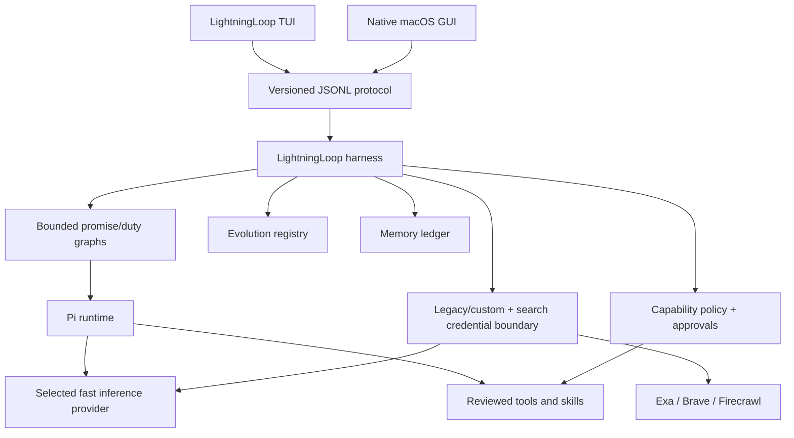

# LightningLoop architecture

Status: current implementation plus target contract for remaining shared run persistence and native tool UI

## Implementation status

| Surface | Current state | Remaining boundary |
| --- | --- | --- |
| Native GUI | Shared JSONL/Pi graph for all loop execution; fail-closed pause when it is unavailable; separate custom-provider connection testing; Pi-auth built-in presets; iterative bounded research/images, notifications, managed-overlay backup/restore/reset, session history, managed memory, reviewed evolution activation/rollback, and opt-in Evidence Lab | shared run persistence and existing-project tool approvals |
| Terminal complete loop | Separate model roles, deterministic Gold, images, iterative reviewer-directed research, real run-owned files, hashes, proactive language checks, structured sandboxed verification, localhost HTML proof, static picture evidence, and workspace audit | persisted runs, hash-verified pictures, and external default-app links; no embedded HTML |
| Pi TUI | Full strict `/loop`, dynamic provider/model, iterative research/image queue, `/artifacts` Evidence Lab grant/revoke, protected memory management, reviewed evolution lifecycle, cancellation, offline startup, read-only default, workspace policy, per-call confirmations, OS-sandboxed shell | persisted run browser and inline image rendering where terminal support exists |
| Search | Exa/Brave/Firecrawl adapters plus bounded pre-plan and reviewer-requested research in the shared harness; parity-tested native code remains unreachable while no-harness execution is blocked | live-provider compatibility matrix |
| Memory | Protected shared ledger; session-bound run memory; explicitly promoted project/user context in GUI, shared harness, and TUI | JSONL mutation messages, semantic relevance ranking, and richer cross-client editing |
| Evolution | Native lifecycle UI; gated activation/rollback; active system prompts and advisory skills affect both runtimes | automated evaluation runner and terminal lifecycle editor |
| MCP/example skills | integrity-pinned sandboxed verify/call; routed contracts; validated 3D and site examples | model activation UI and true multi-view reconstruction |

## Artifact contract

- **User and job:** a person supplies a consequential goal and receives a verified artifact, not merely a plausible answer.
- **Audiences:** terminal-first builders, native macOS users, contributors, and security reviewers.
- **Clients:** a first-class terminal UI and the native SwiftUI application.
- **Shared medium:** one versioned JSONL protocol and one run/artifact schema. Native inference uses it when the locked harness is discoverable. Without that harness, clarification, execution, and Gold are blocked; the native provider client is retained only for explicit custom-provider connection testing in Settings.
- **Inference:** Pi-native provider/model profiles cover Codex, Claude, Grok, Groq, and Fireworks. A bounded custom macOS compatibility profile remains available.
- **Invariant:** a run is Gold only when its stated criteria, evidence requirements, plan review, implementation review, score threshold, and severity gates all pass.
- **Failure states:** missing credentials, malformed model output, denied tool capability, untrusted extension, stale memory, exhausted review rounds, interrupted execution, and failed verification all stop or pause visibly.
- **Proof:** deterministic state-machine tests, protocol contract tests, credential-leak tests, tool-policy tests, live provider probes, client rendering checks, and an end-to-end reviewed example.

## Decision: Pi behind a LightningLoop policy boundary

LightningLoop uses the Pi agent harness for its terminal UI, model transport, and extension API. The native app communicates with the same harness through a LightningLoop-owned JSONL protocol when the locked local build and compatible Node runtime are discoverable. Pi's raw TUI or RPC process is not itself the product boundary.

Why:

- Pi has a maintained terminal UI, a programmatic SDK, session trees and compaction, skills, extensions, tool allowlists, provider catalogs, and a strict JSONL RPC mode.
- Pi intentionally does not impose a permission system. Its built-in tools and third-party packages can run with the launching user's authority.
- LightningLoop therefore owns capability policy, approvals, promise/duty graphs, evolution review, audit events, and workspace confinement around Pi. Pi owns built-in authentication and credential refresh.

The pinned Pi version and its dependency graph are repository-controlled. Updating Pi is a medium-risk change requiring changelog review, tests, a security diff, and a rollback commit.

## Target product layers

## Gold graphs

1. Intake records the goal, workspace, constraints, desired artifact type, and risk classification.
2. The orchestrator asks only decision-critical questions.
3. Answers become atomic criteria with observable evidence.
4. A reviewer attacks the plan criterion by criterion.
5. The orchestrator repairs rejected plans until Gold or the configured cap.
6. The implementer returns either a text deliverable or a bounded declarative artifact manifest inside the approved capability envelope.
7. The harness atomically materializes run-owned files, records hashes, runs declared and proactive bounded checks in the OS sandbox, captures HTML/image previews plus localhost proof, and audits the output directory.
8. The reviewer audits the actual artifact and evidence, not the implementer's summary.
9. The implementer fixes every required change until Gold or the configured cap.
10. The run records completion, unresolved risk, active prompt/skill/tool versions, model, usage, and rollback information.

Gold requires all of the following:

- score at least 9/10;
- no medium, high, or blocking finding;
- no required change;
- every criterion has accepted evidence;
- every required verifier completed successfully;
- no denied or ambiguous capability request was silently skipped.

## Capability model

Capabilities are independent and default to denied:

- read workspace;
- write workspace;
- run local commands;
- access network domains;
- use a named search provider;
- start a named MCP server;
- read a named memory scope;
- propose an evolution;
- activate a reviewed evolution;
- publish or deploy;
- handle high-risk or private data.

A grant records scope, reason, run ID, approver, expiry, and whether it can be reused. Secrets are never capabilities and a capability is never implied by the presence of a credential.

## Credentials

Pi stores and refreshes credentials for Pi-managed named built-in provider presets (Cerebras, Groq, Fireworks, xAI, OpenAI Codex, Anthropic). LightningLoop stores no Pi credential values and does not inspect their presence: those providers surface as `Pi-managed/unknown` until Pi itself runs and reports success or an auth failure. GeneralCompute is LightningLoop-managed (fixed base URL, Keychain or `GENERALCOMPUTE_API_KEY`, Discover Models & Test). Custom macOS API keys and macOS search-provider keys use isolated Keychain services; Windows research can use official environment variables. The native client may test GeneralCompute or an explicitly trusted custom-provider connection, but it does not run the loop or award Gold without the shared harness. Configuration and run records contain only non-secret provider IDs.

The harness must not:

- write secret values to JSON, JSONL, environment files, settings, prompts, memory, exports, telemetry, crash text, or Git;
- expose provider keys to model-visible tool output;
- pass all provider keys through the general tool environment;
- return a secret from a status or doctor command;
- use a search key as authorization for unrelated network access.

Credential tests use synthetic markers. Live keys are never fixtures.

## Memory

Memory is an append-only ledger of typed entries, not an unqualified prompt dump.

Each entry records:

- scope: run, project, or user;
- statement and structured tags;
- source artifact and run;
- author: user, imported source, agent inference, or verifier;
- confidence and verification state;
- created, reviewed, and optional expiry dates;
- sensitivity label;
- supersedes/superseded-by links;
- whether the user approved promotion to a broader scope.

Retrieval is scope-limited and bounded to 12 entries. Run entries must match the active session ID; project and user entries require explicit promotion. Every injected block is labeled untrusted and agents are instructed to use it only when relevant. Semantic relevance ranking is still pending. Deletion is explicit and confirmable. Compaction may summarize conversation history but cannot silently promote a claim into durable memory.

## Evolution

System prompts, skills, tools, MCP definitions, and memory policies share one lifecycle:

`draft -> source-reviewed -> sandbox-tested -> adversarially-reviewed -> user-approved -> active -> superseded/rolled-back`

An evolution record includes the source, exact diff, reason, permissions, evaluation suite/result, reviewer finding state, activation time, and rollback target. The active baseline cannot rewrite itself. Research can inform a proposal; only the ordered review gates and explicit user activation can make it active. Active system-prompt changes and advisory skill guidance enter future agent system channels with size/count bounds and secret-shape rejection. Skill guidance grants no tool or permission. Tool/MCP records remain metadata until their separate integrity and capability checks pass.

Third-party Pi packages and skills remain disabled until source review establishes their permissions and dependency integrity. MCP servers can be verified and called only through exact-invocation approval, integrity-pinned manifests, and the OS sandbox; verification does not promote them into automatic model use. Updates do not float automatically.

## Example workflow families

- **Photo to 3D:** inspect input and rights, choose reconstruction method, preserve source image, produce model files in a scoped workspace, render validation views, and review topology/scale/material criteria.
- **Advanced scripts and applications:** create a repository-local plan, tests, implementation, security review, build/run proof, and rollback notes.
- **Beautiful sites:** define art direction and responsive slots, build locally, validate at representative device widths, check accessibility/console/network behavior, and publish only through a separately authorized deployment capability.

These are narrowly routed built-ins, not hard-coded privileges. The repository includes a dependency-free generated/reopened 2.5D GLB/OBJ example and a responsive landing-page example with 375px/1280px browser evidence.

## Client responsibilities

The implemented shared client contract supports:

- creating runs and continuing a run after clarification;
- answering clarification questions;
- viewing criteria, plan, reviews, evidence, and usage in the native app; the TUI renders the final result and review summary;
- approving or denying individual sandboxed terminal calls in the TUI;
- pausing/cancelling without losing completed state;
- inspecting and managing memory/evolution versions in the native Settings UI and Pi TUI;
- proposing, recording evaluation and reviewer evidence, approving, activating, and rolling back evolutions through explicit ordered transitions;
- adding/removing credentials without displaying stored values.

The native GUI remains a normal macOS sidebar/detail application. The terminal client is not a diagnostic afterthought; today it supplies a complete text or workspace-artifact loop, policy-wrapped Pi TUI, protected memory/evolution ledger control, sandboxed verification/execution, and explicit MCP verification/calls. Native and terminal clients share the memory/evolution ledgers, while run history and resume remain client-local.

## Versioned protocol

Every JSONL envelope includes `protocolVersion`, `type`, `requestID` or `eventID`, `runID`, timestamp, and a typed payload. Unknown required fields or versions fail closed. Secrets are prohibited by schema and redaction tests.

The implemented protocol surface is:

- requests: `hello`, `createRun`, `continueRun`, `cancelRun`, and `credentialStatus`;
- events/responses: `stageChanged`, `runPaused`, `runCompleted`, `response`, and `error`.

Shared snapshots, run listing/resume, capability responses, registry/evolution operations, and memory events remain the next protocol slice; they are design targets rather than accepted message types.

## Deliberate exclusions for the first harness slice

- no autonomous deployment or financial action;
- no unreviewed remote MCP installation;
- no background self-update;
- no silent prompt, skill, tool, or memory-policy activation;
- no cross-project memory by default;
- no claim that model review proves correctness or security.
